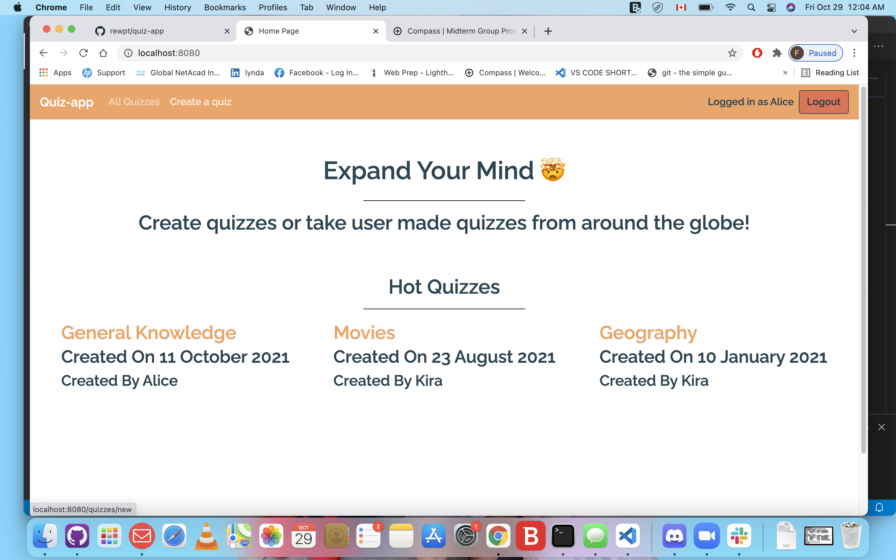
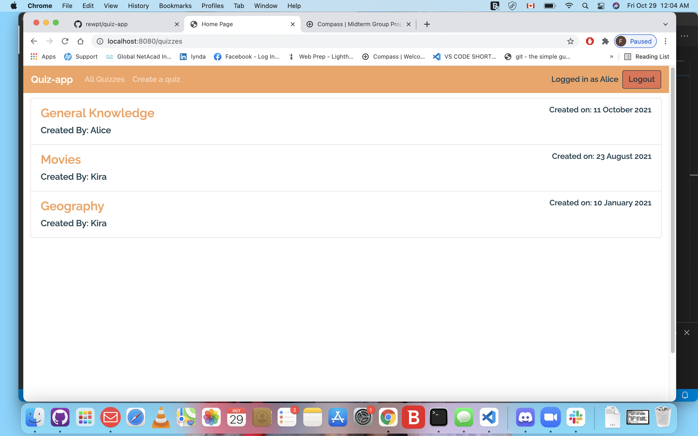
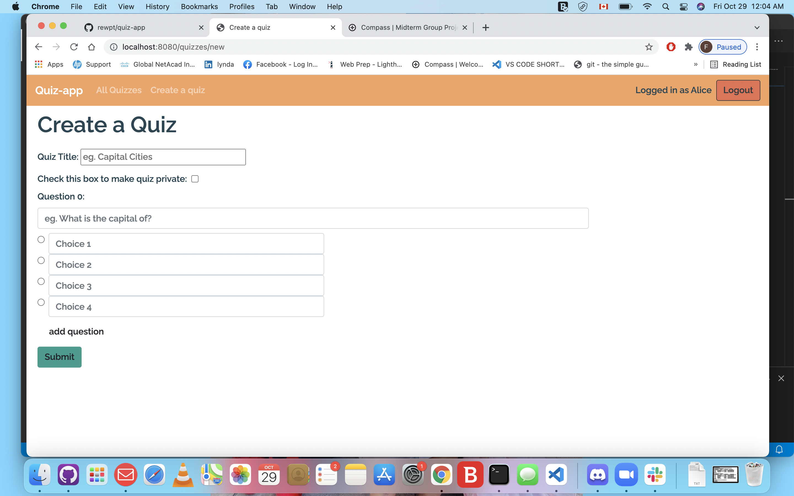
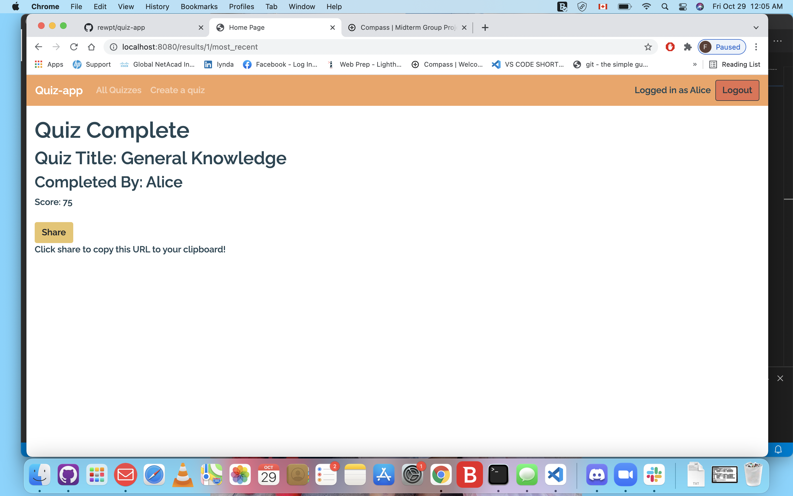

## About Project 

 quiz-app is an app that lets you create,take and share quizzes.The creator of the quiz can view and share all the results at the end of the quiz.

## Getting Started

- Update the .env file with your correct local information 
  - username: `labber` 
  - password: `labber` 
  - database: `midterm`
- Install dependencies: `npm i`
- Reset database: `npm run db:reset`
- npm run local
- Visit `http://localhost:8080/`

## Final Product

